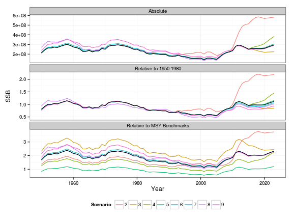
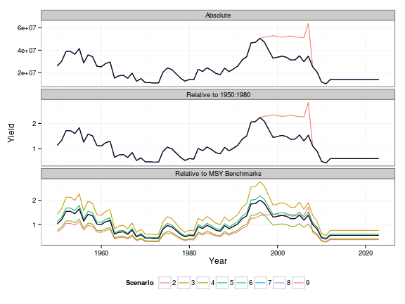
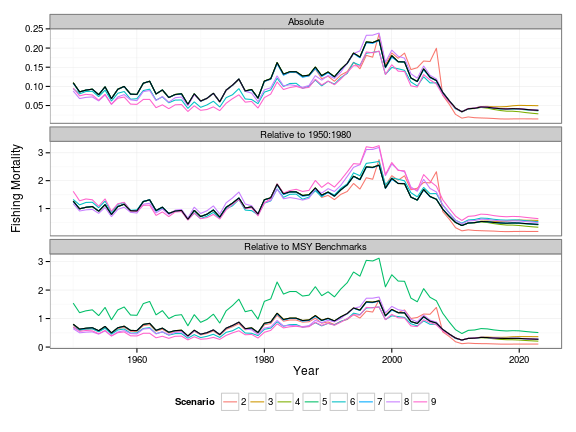
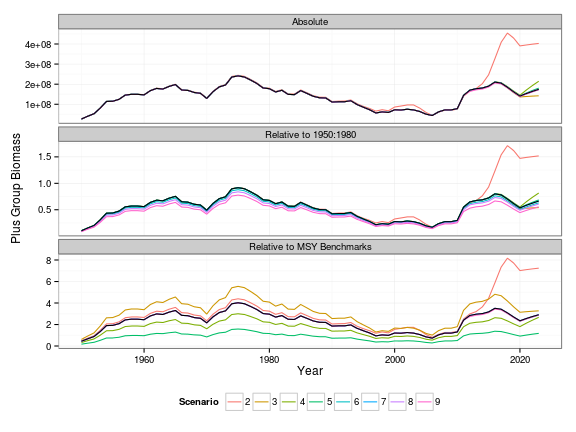

Risk paper II
========================================================
  


**Summary Statistics**


Summary Statistics
----------------------------
**Absolute**

```
        variable
Scenario biomass     ssb     pg yield harvest
       1  1.1818 -0.7158  3.573  6.48   3.868
       2 18.4083 16.4536 23.891  6.48  -9.416
       3 -1.2617 -2.4690  2.553  6.48   7.124
       4  4.2519  1.4898  4.794  6.48   1.140
       5  1.5381 -0.4443  3.751  6.48   3.487
       6  1.0688 -0.8440  3.381  6.48   4.018
       7  1.1782 -0.7193  3.569  6.48   3.873
       8  1.1818 -0.7158  3.573  6.48   3.868
       9  0.9887 -0.9541  3.140  6.48   4.137
```


**Relative to 1950 to 1980**

```
        variable
Scenario biomass     ssb     pg  yield harvest
       1  1.1818 -0.7158  3.573  6.480   3.868
       2 10.3057 10.0377 27.139 -1.398  -9.840
       3  5.0794  3.4150 10.339 15.752   7.124
       4 -1.4152 -3.4743 -1.011  0.246   1.140
       5 -6.9027 -9.2519 -9.461  8.629  23.252
       6  1.0688 -0.8440  3.381  6.480   4.018
       7  1.1782 -0.7193  3.569  6.480   3.873
       8  1.1818 -0.7158  3.573  6.480   3.868
       9  0.9887 -0.9541  3.140  6.480   4.137
```


**Relative to MSY Benchmarks**

```
        variable
Scenario biomass     ssb       pg yield harvest
       1  1.1818 -0.7158  3.57281  6.48   3.868
       2 18.1262 16.1667 23.54206  6.48  -9.356
       3 -1.2617 -2.4690  2.55328  6.48   7.124
       4  4.2519  1.4898  4.79378  6.48   1.140
       5  1.5381 -0.4443  3.75142  6.48   3.487
       6 -1.0258 -1.5505  2.50082  6.48   8.774
       7  1.0568 -0.7193  3.56905  6.48   3.969
       8 -0.5618 -2.2036  1.71617  6.48   7.273
       9 -2.6089 -3.5354 -0.06089  6.48  14.475
```


```

% Table created by stargazer v.4.5.3 by Marek Hlavac, Harvard University. E-mail: hlavac at fas.harvard.edu
% Date and time: Fri, Dec 13, 2013 - 11:25:55
\begin{table}[!htbp] \centering 
  \caption{} 
  \label{} 
\begin{tabular}{@{\extracolsep{5pt}} ccccc} 
\\[-1.8ex]\hline 
\hline \\[-1.8ex] 
biomass & ssb & pg & yield & harvest \\ 
\hline \\[-1.8ex] 
$1.182$ & $$-$0.716$ & $3.573$ & $6.480$ & $3.868$ \\ 
$18.410$ & $16.450$ & $23.890$ & $6.480$ & $$-$9.416$ \\ 
$$-$1.262$ & $$-$2.469$ & $2.553$ & $6.480$ & $7.124$ \\ 
$4.252$ & $1.490$ & $4.794$ & $6.480$ & $1.140$ \\ 
$1.538$ & $$-$0.444$ & $3.751$ & $6.480$ & $3.487$ \\ 
$1.069$ & $$-$0.844$ & $3.381$ & $6.480$ & $4.018$ \\ 
$1.178$ & $$-$0.719$ & $3.569$ & $6.480$ & $3.873$ \\ 
$1.182$ & $$-$0.716$ & $3.573$ & $6.480$ & $3.868$ \\ 
$0.989$ & $$-$0.954$ & $3.140$ & $6.480$ & $4.137$ \\ 
\hline \\[-1.8ex] 
\normalsize 
\end{tabular} 
\end{table} 
```

```

% Table created by stargazer v.4.5.3 by Marek Hlavac, Harvard University. E-mail: hlavac at fas.harvard.edu
% Date and time: Fri, Dec 13, 2013 - 11:25:55
\begin{table}[!htbp] \centering 
  \caption{} 
  \label{} 
\begin{tabular}{@{\extracolsep{5pt}} ccccc} 
\\[-1.8ex]\hline 
\hline \\[-1.8ex] 
biomass & ssb & pg & yield & harvest \\ 
\hline \\[-1.8ex] 
$1.182$ & $$-$0.716$ & $3.573$ & $6.480$ & $3.868$ \\ 
$10.310$ & $10.040$ & $27.140$ & $$-$1.398$ & $$-$9.840$ \\ 
$5.079$ & $3.415$ & $10.340$ & $15.750$ & $7.124$ \\ 
$$-$1.415$ & $$-$3.474$ & $$-$1.011$ & $0.246$ & $1.140$ \\ 
$$-$6.903$ & $$-$9.252$ & $$-$9.461$ & $8.629$ & $23.250$ \\ 
$1.069$ & $$-$0.844$ & $3.381$ & $6.480$ & $4.018$ \\ 
$1.178$ & $$-$0.719$ & $3.569$ & $6.480$ & $3.873$ \\ 
$1.182$ & $$-$0.716$ & $3.573$ & $6.480$ & $3.868$ \\ 
$0.989$ & $$-$0.954$ & $3.140$ & $6.480$ & $4.137$ \\ 
\hline \\[-1.8ex] 
\normalsize 
\end{tabular} 
\end{table} 
```

```

% Table created by stargazer v.4.5.3 by Marek Hlavac, Harvard University. E-mail: hlavac at fas.harvard.edu
% Date and time: Fri, Dec 13, 2013 - 11:25:55
\begin{table}[!htbp] \centering 
  \caption{} 
  \label{} 
\begin{tabular}{@{\extracolsep{5pt}} ccccc} 
\\[-1.8ex]\hline 
\hline \\[-1.8ex] 
biomass & ssb & pg & yield & harvest \\ 
\hline \\[-1.8ex] 
$1.182$ & $$-$0.716$ & $3.573$ & $6.480$ & $3.868$ \\ 
$18.130$ & $16.170$ & $23.540$ & $6.480$ & $$-$9.356$ \\ 
$$-$1.262$ & $$-$2.469$ & $2.553$ & $6.480$ & $7.124$ \\ 
$4.252$ & $1.490$ & $4.794$ & $6.480$ & $1.140$ \\ 
$1.538$ & $$-$0.444$ & $3.751$ & $6.480$ & $3.487$ \\ 
$$-$1.026$ & $$-$1.551$ & $2.501$ & $6.480$ & $8.774$ \\ 
$1.057$ & $$-$0.719$ & $3.569$ & $6.480$ & $3.969$ \\ 
$$-$0.562$ & $$-$2.204$ & $1.716$ & $6.480$ & $7.273$ \\ 
$$-$2.609$ & $$-$3.535$ & $$-$0.061$ & $6.480$ & $14.470$ \\ 
\hline \\[-1.8ex] 
\normalsize 
\end{tabular} 
\end{table} 
```


Plots
-----------------------------
**SSB**
 


**Yield**
 


**Fishing Mortality**
 


**Plus Group Biomass**
 


