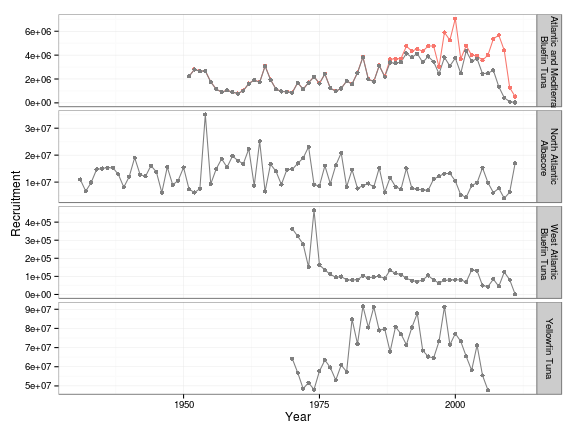
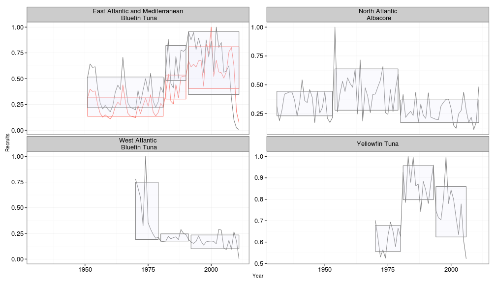
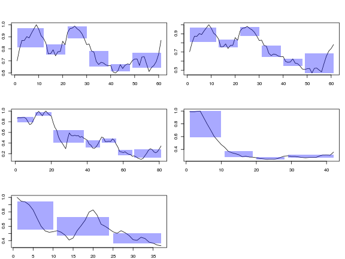

SCRS 2014, stk recruit analysis
========================================================


**set up paths and scenarios etc.** 


**Get time series**

```
  Nelder-Mead direct search function minimizer
function value for initial parameters = 116.221087
  Scaled convergence tolerance is 1.73183e-06
Stepsize computed as 5493474.891367
BUILD              3 120.602150 105.659609
LO-REDUCTION       5 116.221087 103.770765
HI-REDUCTION       7 105.659609 103.770765
HI-REDUCTION       9 105.542992 103.770765
HI-REDUCTION      11 104.120448 103.770765
REFLECTION        13 103.965674 103.606578
REFLECTION        15 103.770765 103.423386
REFLECTION        17 103.606578 103.248539
REFLECTION        19 103.423386 103.079390
REFLECTION        21 103.248539 102.892492
REFLECTION        23 103.079390 102.740010
REFLECTION        25 102.892492 102.539510
REFLECTION        27 102.740010 102.406652
REFLECTION        29 102.539510 102.190824
REFLECTION        31 102.406652 102.080923
REFLECTION        33 102.190824 101.847843
REFLECTION        35 102.080923 101.764653
REFLECTION        37 101.847843 101.512183
REFLECTION        39 101.764653 101.459927
REFLECTION        41 101.512183 101.185692
REFLECTION        43 101.459927 101.169119
REFLECTION        45 101.185692 100.870480
LO-REDUCTION      47 101.169119 100.761010
LO-REDUCTION      49 100.870480 100.712527
REFLECTION        51 100.761010 100.711388
REFLECTION        53 100.712527 100.565062
LO-REDUCTION      55 100.711388 100.549184
LO-REDUCTION      57 100.565062 100.493976
LO-REDUCTION      59 100.549184 100.483990
LO-REDUCTION      61 100.493976 100.460321
HI-REDUCTION      63 100.483990 100.453465
HI-REDUCTION      65 100.460321 100.443872
LO-REDUCTION      67 100.453465 100.443872
HI-REDUCTION      69 100.448190 100.443872
EXTENSION         71 100.445457 100.439714
EXTENSION         73 100.443872 100.430294
EXTENSION         75 100.439714 100.426875
EXTENSION         77 100.430294 100.392080
LO-REDUCTION      79 100.426875 100.392080
EXTENSION         81 100.401108 100.326127
LO-REDUCTION      83 100.392080 100.326127
EXTENSION         85 100.352479 100.235579
EXTENSION         87 100.326127 100.139811
EXTENSION         89 100.235579 99.925996
EXTENSION         91 100.139811 99.658536
EXTENSION         93 99.925996 99.251845
EXTENSION         95 99.658536 98.981473
LO-REDUCTION      97 99.251845 98.981473
HI-REDUCTION      99 99.039170 98.981473
HI-REDUCTION     101 98.998162 98.981473
HI-REDUCTION     103 98.988748 98.981473
HI-REDUCTION     105 98.981547 98.979057
HI-REDUCTION     107 98.981473 98.978024
HI-REDUCTION     109 98.979057 98.977608
HI-REDUCTION     111 98.978024 98.977608
LO-REDUCTION     113 98.977611 98.977317
HI-REDUCTION     115 98.977608 98.977244
HI-REDUCTION     117 98.977333 98.977244
HI-REDUCTION     119 98.977317 98.977244
LO-REDUCTION     121 98.977265 98.977243
HI-REDUCTION     123 98.977244 98.977234
HI-REDUCTION     125 98.977243 98.977234
LO-REDUCTION     127 98.977236 98.977232
HI-REDUCTION     129 98.977234 98.977232
Exiting from Nelder Mead minimizer
    131 function evaluations used
  Nelder-Mead direct search function minimizer
function value for initial parameters = 82.669936
  Scaled convergence tolerance is 1.23188e-06
Stepsize computed as 5533081.331990
BUILD              3 85.224813 77.494824
LO-REDUCTION       5 82.669936 76.484293
HI-REDUCTION       7 77.494824 76.484293
HI-REDUCTION       9 76.906545 76.484293
HI-REDUCTION      11 76.521204 76.260639
REFLECTION        13 76.484293 76.192684
HI-REDUCTION      15 76.260639 76.192684
LO-REDUCTION      17 76.249698 76.187688
REFLECTION        19 76.192684 76.177627
EXTENSION         21 76.187688 76.133372
REFLECTION        23 76.177627 76.111414
REFLECTION        25 76.133372 76.083019
REFLECTION        27 76.111414 76.048371
REFLECTION        29 76.083019 76.037195
REFLECTION        31 76.048371 75.989014
LO-REDUCTION      33 76.037195 75.980334
LO-REDUCTION      35 75.989014 75.964113
LO-REDUCTION      37 75.980334 75.959172
LO-REDUCTION      39 75.964113 75.953244
LO-REDUCTION      41 75.959172 75.950759
LO-REDUCTION      43 75.953244 75.948419
LO-REDUCTION      45 75.950759 75.947231
LO-REDUCTION      47 75.948419 75.946242
LO-REDUCTION      49 75.947231 75.945684
LO-REDUCTION      51 75.946242 75.945242
HI-REDUCTION      53 75.945684 75.944967
HI-REDUCTION      55 75.945242 75.944607
LO-REDUCTION      57 75.944967 75.944607
HI-REDUCTION      59 75.944696 75.944607
REFLECTION        61 75.944681 75.944572
REFLECTION        63 75.944607 75.944520
REFLECTION        65 75.944572 75.944465
REFLECTION        67 75.944520 75.944436
EXTENSION         69 75.944465 75.944352
EXTENSION         71 75.944436 75.944157
REFLECTION        73 75.944352 75.944075
EXTENSION         75 75.944157 75.943823
EXTENSION         77 75.944075 75.943218
REFLECTION        79 75.943823 75.943141
EXTENSION         81 75.943218 75.941867
EXTENSION         83 75.943141 75.941051
EXTENSION         85 75.941867 75.938048
EXTENSION         87 75.941051 75.934906
EXTENSION         89 75.938048 75.927283
EXTENSION         91 75.934906 75.917430
EXTENSION         93 75.927283 75.897674
EXTENSION         95 75.917430 75.870695
EXTENSION         97 75.897674 75.823830
EXTENSION         99 75.870695 75.773124
EXTENSION        101 75.823830 75.737272
LO-REDUCTION     103 75.773124 75.737272
HI-REDUCTION     105 75.738688 75.737272
HI-REDUCTION     107 75.738515 75.732884
HI-REDUCTION     109 75.737272 75.732102
HI-REDUCTION     111 75.732884 75.732102
LO-REDUCTION     113 75.732483 75.731732
HI-REDUCTION     115 75.732102 75.731629
HI-REDUCTION     117 75.731732 75.731587
LO-REDUCTION     119 75.731629 75.731535
HI-REDUCTION     121 75.731587 75.731525
HI-REDUCTION     123 75.731535 75.731525
HI-REDUCTION     125 75.731527 75.731520
HI-REDUCTION     127 75.731525 75.731517
HI-REDUCTION     129 75.731520 75.731517
Exiting from Nelder Mead minimizer
    131 function evaluations used
  Nelder-Mead direct search function minimizer
function value for initial parameters = 112.019900
  Scaled convergence tolerance is 1.66923e-06
Stepsize computed as 2724027.907411
BUILD              3 114.104946 112.019900
LO-REDUCTION       5 112.966602 111.452284
LO-REDUCTION       7 112.019900 110.983957
LO-REDUCTION       9 111.452284 110.735568
HI-REDUCTION      11 110.983957 110.546101
HI-REDUCTION      13 110.735568 110.235311
LO-REDUCTION      15 110.546101 110.235311
HI-REDUCTION      17 110.318637 110.235311
HI-REDUCTION      19 110.302257 110.235311
EXTENSION         21 110.270684 110.149683
EXTENSION         23 110.235311 110.043499
EXTENSION         25 110.149683 109.803620
EXTENSION         27 110.043499 109.510525
EXTENSION         29 109.803620 108.840650
EXTENSION         31 109.510525 108.169225
EXTENSION         33 108.840650 106.608066
LO-REDUCTION      35 108.169225 106.608066
REFLECTION        37 106.622534 106.180461
LO-REDUCTION      39 106.608066 106.076399
HI-REDUCTION      41 106.180461 106.076399
HI-REDUCTION      43 106.120247 106.001560
HI-REDUCTION      45 106.076399 106.001560
LO-REDUCTION      47 106.040238 105.998998
HI-REDUCTION      49 106.004364 105.998998
HI-REDUCTION      51 106.001560 105.996795
HI-REDUCTION      53 105.998998 105.996164
HI-REDUCTION      55 105.996795 105.996164
HI-REDUCTION      57 105.996487 105.995898
HI-REDUCTION      59 105.996164 105.995871
HI-REDUCTION      61 105.995898 105.995729
HI-REDUCTION      63 105.995871 105.995729
REFLECTION        65 105.995759 105.995714
HI-REDUCTION      67 105.995729 105.995688
LO-REDUCTION      69 105.995714 105.995688
Exiting from Nelder Mead minimizer
    71 function evaluations used
  Nelder-Mead direct search function minimizer
function value for initial parameters = 121.491563
  Scaled convergence tolerance is 1.81037e-06
Stepsize computed as 5191567.929201
BUILD              3 124.549873 117.898910
LO-REDUCTION       5 121.491563 115.853482
HI-REDUCTION       7 117.898910 115.496443
LO-REDUCTION       9 115.853482 115.252877
HI-REDUCTION      11 115.496443 115.074774
REFLECTION        13 115.252877 114.808642
HI-REDUCTION      15 115.074774 114.808642
EXTENSION         17 114.949869 114.626158
EXTENSION         19 114.808642 114.036688
LO-REDUCTION      21 114.626158 114.036688
EXTENSION         23 114.041231 112.837454
LO-REDUCTION      25 114.036688 112.837454
EXTENSION         27 113.434496 112.519098
REFLECTION        29 112.837454 112.017315
HI-REDUCTION      31 112.519098 112.017315
REFLECTION        33 112.223918 111.816088
LO-REDUCTION      35 112.017315 111.748814
LO-REDUCTION      37 111.816088 111.723727
LO-REDUCTION      39 111.748814 111.682581
LO-REDUCTION      41 111.723727 111.682581
LO-REDUCTION      43 111.690639 111.662083
HI-REDUCTION      45 111.682581 111.659927
LO-REDUCTION      47 111.662083 111.655578
HI-REDUCTION      49 111.659927 111.655578
EXTENSION         51 111.656307 111.652485
EXTENSION         53 111.655578 111.646402
LO-REDUCTION      55 111.652485 111.646402
REFLECTION        57 111.647730 111.644874
HI-REDUCTION      59 111.646402 111.644874
REFLECTION        61 111.645324 111.644179
HI-REDUCTION      63 111.644874 111.644179
HI-REDUCTION      65 111.644444 111.644179
LO-REDUCTION      67 111.644338 111.644179
HI-REDUCTION      69 111.644213 111.644179
REFLECTION        71 111.644187 111.644174
HI-REDUCTION      73 111.644179 111.644148
HI-REDUCTION      75 111.644174 111.644148
LO-REDUCTION      77 111.644156 111.644148
HI-REDUCTION      79 111.644150 111.644148
Exiting from Nelder Mead minimizer
    81 function evaluations used
  Nelder-Mead direct search function minimizer
function value for initial parameters = 120.833580
  Scaled convergence tolerance is 1.80056e-06
Stepsize computed as 6657715.725234
BUILD              3 124.697761 109.885329
LO-REDUCTION       5 120.833580 109.469910
LO-REDUCTION       7 112.022454 109.469910
HI-REDUCTION       9 110.266519 109.469910
LO-REDUCTION      11 109.885329 109.469910
HI-REDUCTION      13 109.740417 109.469910
REFLECTION        15 109.642572 109.461983
EXTENSION         17 109.469910 109.037312
LO-REDUCTION      19 109.461983 109.037312
EXTENSION         21 109.066043 108.276024
LO-REDUCTION      23 109.037312 108.276024
EXTENSION         25 108.610812 107.774481
EXTENSION         27 108.276024 106.983584
HI-REDUCTION      29 107.774481 106.983584
EXTENSION         31 107.629101 106.451866
LO-REDUCTION      33 106.983584 106.451866
REFLECTION        35 106.458944 106.326981
HI-REDUCTION      37 106.451866 106.326981
HI-REDUCTION      39 106.333576 106.326981
LO-REDUCTION      41 106.328917 106.295262
HI-REDUCTION      43 106.326981 106.288079
LO-REDUCTION      45 106.296991 106.288079
HI-REDUCTION      47 106.295262 106.288079
HI-REDUCTION      49 106.290158 106.288079
REFLECTION        51 106.289057 106.286845
HI-REDUCTION      53 106.288079 106.286845
HI-REDUCTION      55 106.287327 106.286845
LO-REDUCTION      57 106.287034 106.286747
HI-REDUCTION      59 106.286845 106.286747
HI-REDUCTION      61 106.286769 106.286730
HI-REDUCTION      63 106.286747 106.286730
HI-REDUCTION      65 106.286730 106.286724
HI-REDUCTION      67 106.286730 106.286719
LO-REDUCTION      69 106.286724 106.286719
Exiting from Nelder Mead minimizer
    71 function evaluations used
  Nelder-Mead direct search function minimizer
function value for initial parameters = 109.658656
  Scaled convergence tolerance is 1.63404e-06
Stepsize computed as 5122941.513294
BUILD              3 113.136715 104.214270
LO-REDUCTION       5 109.658656 102.280338
HI-REDUCTION       7 104.214270 102.280338
LO-REDUCTION       9 102.752209 102.280338
REFLECTION        11 102.402401 101.917807
HI-REDUCTION      13 102.280338 101.676925
EXTENSION         15 101.917807 101.241637
HI-REDUCTION      17 101.676925 101.241637
EXTENSION         19 101.449739 100.350399
LO-REDUCTION      21 101.241637 100.350399
EXTENSION         23 100.716648 99.019207
EXTENSION         25 100.350399 98.493863
EXTENSION         27 99.019207 97.307014
HI-REDUCTION      29 98.493863 97.307014
REFLECTION        31 97.875387 96.786358
HI-REDUCTION      33 97.307014 96.786358
REFLECTION        35 96.985785 96.641151
LO-REDUCTION      37 96.786358 96.533418
HI-REDUCTION      39 96.641151 96.533418
HI-REDUCTION      41 96.559113 96.511637
REFLECTION        43 96.533418 96.482704
HI-REDUCTION      45 96.511637 96.482704
LO-REDUCTION      47 96.488762 96.482704
HI-REDUCTION      49 96.487163 96.481826
LO-REDUCTION      51 96.482704 96.481695
HI-REDUCTION      53 96.481826 96.480490
HI-REDUCTION      55 96.481695 96.480041
LO-REDUCTION      57 96.480490 96.479993
HI-REDUCTION      59 96.480041 96.479993
HI-REDUCTION      61 96.480013 96.479948
HI-REDUCTION      63 96.479993 96.479942
HI-REDUCTION      65 96.479948 96.479942
HI-REDUCTION      67 96.479947 96.479937
HI-REDUCTION      69 96.479942 96.479937
Exiting from Nelder Mead minimizer
    71 function evaluations used
  Nelder-Mead direct search function minimizer
function value for initial parameters = 117.744757
  Scaled convergence tolerance is 1.75453e-06
Stepsize computed as 3421642.831039
BUILD              3 121.182600 111.319305
REFLECTION         5 117.744757 111.213661
HI-REDUCTION       7 111.427161 111.213661
HI-REDUCTION       9 111.319305 110.589942
EXTENSION         11 111.213661 109.179998
LO-REDUCTION      13 110.589942 109.179998
EXTENSION         15 109.592409 107.206233
LO-REDUCTION      17 109.179998 107.206233
LO-REDUCTION      19 108.092892 107.206233
EXTENSION         21 107.225975 105.673469
LO-REDUCTION      23 107.206233 105.673469
REFLECTION        25 105.935240 105.122154
LO-REDUCTION      27 105.673469 105.122154
LO-REDUCTION      29 105.192388 105.122154
HI-REDUCTION      31 105.184564 105.113526
HI-REDUCTION      33 105.122154 105.110263
HI-REDUCTION      35 105.113526 105.101835
HI-REDUCTION      37 105.110263 105.101835
HI-REDUCTION      39 105.102805 105.101172
REFLECTION        41 105.101835 105.101028
HI-REDUCTION      43 105.101172 105.099624
HI-REDUCTION      45 105.101028 105.099425
LO-REDUCTION      47 105.099624 105.099425
HI-REDUCTION      49 105.099469 105.099294
HI-REDUCTION      51 105.099425 105.099294
HI-REDUCTION      53 105.099311 105.099292
LO-REDUCTION      55 105.099294 105.099272
HI-REDUCTION      57 105.099292 105.099265
HI-REDUCTION      59 105.099272 105.099265
LO-REDUCTION      61 105.099266 105.099263
HI-REDUCTION      63 105.099265 105.099263
Exiting from Nelder Mead minimizer
    65 function evaluations used
  Nelder-Mead direct search function minimizer
function value for initial parameters = 121.878947
  Scaled convergence tolerance is 1.81614e-06
Stepsize computed as 5813719.888694
BUILD              3 124.872242 121.878947
HI-REDUCTION       5 122.626398 118.287232
HI-REDUCTION       7 121.878947 116.814987
LO-REDUCTION       9 118.287232 116.814987
HI-REDUCTION      11 117.048715 116.780177
REFLECTION        13 116.814987 116.615668
HI-REDUCTION      15 116.780177 116.558811
EXTENSION         17 116.615668 116.254468
HI-REDUCTION      19 116.558811 116.254468
EXTENSION         21 116.430817 115.820791
EXTENSION         23 116.254468 115.655603
EXTENSION         25 115.820791 114.620126
LO-REDUCTION      27 115.655603 114.620126
REFLECTION        29 115.196131 114.532073
EXTENSION         31 114.620126 113.642395
HI-REDUCTION      33 114.532073 113.642395
LO-REDUCTION      35 114.177067 113.642395
LO-REDUCTION      37 113.666186 113.610911
HI-REDUCTION      39 113.642395 113.610911
LO-REDUCTION      41 113.611183 113.597202
HI-REDUCTION      43 113.610911 113.593574
LO-REDUCTION      45 113.597202 113.593574
HI-REDUCTION      47 113.596559 113.593574
LO-REDUCTION      49 113.593766 113.593022
HI-REDUCTION      51 113.593574 113.592916
HI-REDUCTION      53 113.593022 113.592916
HI-REDUCTION      55 113.592968 113.592859
HI-REDUCTION      57 113.592916 113.592854
HI-REDUCTION      59 113.592859 113.592843
HI-REDUCTION      61 113.592854 113.592838
HI-REDUCTION      63 113.592843 113.592838
HI-REDUCTION      65 113.592839 113.592835
LO-REDUCTION      67 113.592838 113.592835
Exiting from Nelder Mead minimizer
    69 function evaluations used
  Nelder-Mead direct search function minimizer
function value for initial parameters = 123.331352
  Scaled convergence tolerance is 1.83778e-06
Stepsize computed as 6868008.045239
BUILD              3 127.346165 114.198448
LO-REDUCTION       5 123.331352 111.632234
HI-REDUCTION       7 114.198448 111.632234
HI-REDUCTION       9 112.324658 111.632234
HI-REDUCTION      11 111.967724 111.196778
REFLECTION        13 111.632234 110.890010
HI-REDUCTION      15 111.196778 110.890010
EXTENSION         17 111.134165 110.747491
EXTENSION         19 110.890010 109.972564
REFLECTION        21 110.747491 109.916967
EXTENSION         23 109.972564 108.568598
EXTENSION         25 109.916967 107.638056
REFLECTION        27 108.568598 106.741453
LO-REDUCTION      29 107.638056 106.557008
LO-REDUCTION      31 106.741453 106.502043
HI-REDUCTION      33 106.557008 106.429891
HI-REDUCTION      35 106.502043 106.330714
HI-REDUCTION      37 106.429891 106.330714
REFLECTION        39 106.379377 106.306863
HI-REDUCTION      41 106.330714 106.306863
LO-REDUCTION      43 106.318042 106.306863
HI-REDUCTION      45 106.308635 106.305670
HI-REDUCTION      47 106.306863 106.304031
HI-REDUCTION      49 106.305670 106.302871
HI-REDUCTION      51 106.304031 106.302871
REFLECTION        53 106.303567 106.302780
HI-REDUCTION      55 106.302871 106.302722
HI-REDUCTION      57 106.302780 106.302636
HI-REDUCTION      59 106.302722 106.302624
HI-REDUCTION      61 106.302636 106.302615
HI-REDUCTION      63 106.302624 106.302605
HI-REDUCTION      65 106.302615 106.302604
HI-REDUCTION      67 106.302605 106.302602
HI-REDUCTION      69 106.302604 106.302602
Exiting from Nelder Mead minimizer
    71 function evaluations used
  Nelder-Mead direct search function minimizer
function value for initial parameters = 126.496912
  Scaled convergence tolerance is 1.88495e-06
Stepsize computed as 5338109.083156
BUILD              3 129.471428 123.336924
LO-REDUCTION       5 126.496912 120.711507
HI-REDUCTION       7 123.336924 119.578437
LO-REDUCTION       9 120.711507 119.426548
HI-REDUCTION      11 119.578437 119.426548
REFLECTION        13 119.451842 119.236011
LO-REDUCTION      15 119.426548 119.160028
LO-REDUCTION      17 119.236011 119.127631
LO-REDUCTION      19 119.160028 119.064530
HI-REDUCTION      21 119.127631 119.064530
HI-REDUCTION      23 119.069160 119.048378
EXTENSION         25 119.064530 119.007758
HI-REDUCTION      27 119.048378 119.007758
EXTENSION         29 119.030015 118.970506
EXTENSION         31 119.007758 118.888285
EXTENSION         33 118.970506 118.823721
EXTENSION         35 118.888285 118.562253
LO-REDUCTION      37 118.823721 118.562253
EXTENSION         39 118.579106 118.011830
LO-REDUCTION      41 118.562253 118.011830
EXTENSION         43 118.132107 117.207644
EXTENSION         45 118.011830 116.901862
REFLECTION        47 117.207644 116.895121
HI-REDUCTION      49 116.901862 116.829043
HI-REDUCTION      51 116.895121 116.750775
HI-REDUCTION      53 116.829043 116.718485
HI-REDUCTION      55 116.750775 116.718485
LO-REDUCTION      57 116.749611 116.718485
HI-REDUCTION      59 116.721429 116.718485
HI-REDUCTION      61 116.720587 116.715809
LO-REDUCTION      63 116.718485 116.714873
LO-REDUCTION      65 116.715809 116.714591
LO-REDUCTION      67 116.714873 116.713893
HI-REDUCTION      69 116.714591 116.713671
HI-REDUCTION      71 116.713893 116.713450
LO-REDUCTION      73 116.713671 116.713450
HI-REDUCTION      75 116.713491 116.713446
REFLECTION        77 116.713450 116.713377
HI-REDUCTION      79 116.713446 116.713377
REFLECTION        81 116.713398 116.713365
EXTENSION         83 116.713377 116.713330
LO-REDUCTION      85 116.713365 116.713330
LO-REDUCTION      87 116.713334 116.713328
HI-REDUCTION      89 116.713330 116.713326
LO-REDUCTION      91 116.713328 116.713326
Exiting from Nelder Mead minimizer
    93 function evaluations used
  Nelder-Mead direct search function minimizer
function value for initial parameters = 121.539740
  Scaled convergence tolerance is 1.81108e-06
Stepsize computed as 5405868.838958
BUILD              3 124.395963 121.539740
HI-REDUCTION       5 122.781168 118.622479
HI-REDUCTION       7 121.539740 117.444494
LO-REDUCTION       9 118.622479 117.444494
HI-REDUCTION      11 117.697234 117.371522
REFLECTION        13 117.444494 117.163891
HI-REDUCTION      15 117.371522 117.163891
EXTENSION         17 117.183465 116.840070
EXTENSION         19 117.163891 116.494033
EXTENSION         21 116.840070 116.037371
EXTENSION         23 116.494033 114.526870
LO-REDUCTION      25 116.037371 114.526870
REFLECTION        27 114.832846 113.551045
LO-REDUCTION      29 114.526870 113.551045
LO-REDUCTION      31 114.141577 113.551045
EXTENSION         33 113.629753 113.039960
LO-REDUCTION      35 113.551045 113.039960
HI-REDUCTION      37 113.221297 113.039960
LO-REDUCTION      39 113.164236 113.039960
LO-REDUCTION      41 113.105713 113.039960
REFLECTION        43 113.083676 113.038945
REFLECTION        45 113.039960 113.020608
HI-REDUCTION      47 113.038945 113.020608
HI-REDUCTION      49 113.026355 113.020608
LO-REDUCTION      51 113.024930 113.019924
HI-REDUCTION      53 113.020608 113.019924
HI-REDUCTION      55 113.020315 113.019561
HI-REDUCTION      57 113.019924 113.019561
LO-REDUCTION      59 113.019679 113.019509
HI-REDUCTION      61 113.019561 113.019508
HI-REDUCTION      63 113.019509 113.019490
HI-REDUCTION      65 113.019508 113.019488
HI-REDUCTION      67 113.019490 113.019487
HI-REDUCTION      69 113.019488 113.019482
LO-REDUCTION      71 113.019487 113.019482
Exiting from Nelder Mead minimizer
    73 function evaluations used
[1] "med/bfte2012.d1"  "med/bfte2012.p1"  "med/MINUS0.R"    
[4] "med/bfte2012.e1"  "med/bfte2012.csv" "none"            
  Nelder-Mead direct search function minimizer
function value for initial parameters = 118.255561
  Scaled convergence tolerance is 1.76215e-06
Stepsize computed as 13997203.175560
BUILD              3 167.710880 118.255561
HI-REDUCTION       5 151.400972 118.255561
HI-REDUCTION       7 136.644659 118.255561
HI-REDUCTION       9 126.437711 118.255561
HI-REDUCTION      11 121.329425 118.255561
HI-REDUCTION      13 119.345844 118.255561
LO-REDUCTION      15 118.323181 118.255561
EXTENSION         17 118.271272 117.878896
LO-REDUCTION      19 118.255561 117.878896
EXTENSION         21 118.032355 117.398470
LO-REDUCTION      23 117.878896 117.398470
LO-REDUCTION      25 117.666123 117.398470
EXTENSION         27 117.435292 116.782488
LO-REDUCTION      29 117.398470 116.782488
EXTENSION         31 116.905833 115.369664
EXTENSION         33 116.782488 113.821496
REFLECTION        35 115.369664 110.707868
REFLECTION        37 113.821496 109.491792
HI-REDUCTION      39 111.691391 109.491792
HI-REDUCTION      41 110.707868 109.491792
HI-REDUCTION      43 110.351808 109.491792
HI-REDUCTION      45 109.699511 109.461723
HI-REDUCTION      47 109.491792 109.080360
HI-REDUCTION      49 109.461723 108.660286
REFLECTION        51 109.080360 108.550283
HI-REDUCTION      53 108.734130 108.550283
HI-REDUCTION      55 108.660286 108.550283
REFLECTION        57 108.622218 108.495020
HI-REDUCTION      59 108.550283 108.495020
LO-REDUCTION      61 108.541311 108.495020
REFLECTION        63 108.506709 108.473082
HI-REDUCTION      65 108.495020 108.473082
EXTENSION         67 108.488643 108.457375
REFLECTION        69 108.473082 108.449061
REFLECTION        71 108.457375 108.444062
REFLECTION        73 108.449061 108.443041
LO-REDUCTION      75 108.444062 108.442623
HI-REDUCTION      77 108.443041 108.441417
HI-REDUCTION      79 108.442623 108.441269
LO-REDUCTION      81 108.441417 108.441020
HI-REDUCTION      83 108.441269 108.441020
HI-REDUCTION      85 108.441026 108.441020
HI-REDUCTION      87 108.441024 108.440977
HI-REDUCTION      89 108.441020 108.440975
HI-REDUCTION      91 108.440979 108.440975
HI-REDUCTION      93 108.440977 108.440971
HI-REDUCTION      95 108.440975 108.440971
Exiting from Nelder Mead minimizer
    97 function evaluations used
[1] "med/bfte2012.d1"  "med/bfte2012.p1"  "med/MINUS0.R"    
[4] "med/bfte2012.e1"  "med/bfte2012.csv" "none"            
  Nelder-Mead direct search function minimizer
function value for initial parameters = 102.219017
  Scaled convergence tolerance is 1.52318e-06
Stepsize computed as 16002975.594215
BUILD              3 161.686569 102.219017
HI-REDUCTION       5 143.013034 102.219017
HI-REDUCTION       7 125.227572 102.219017
HI-REDUCTION       9 112.302976 102.219017
HI-REDUCTION      11 105.763264 102.219017
HI-REDUCTION      13 103.347609 102.219017
HI-REDUCTION      15 102.603759 102.219017
LO-REDUCTION      17 102.429669 102.219017
EXTENSION         19 102.346029 101.898591
LO-REDUCTION      21 102.219017 101.898591
EXTENSION         23 102.065917 101.527229
EXTENSION         25 101.898591 100.758282
EXTENSION         27 101.527229 99.858935
EXTENSION         29 100.758282 95.010650
HI-REDUCTION      31 99.858935 95.010650
EXTENSION         33 99.309884 89.421063
HI-REDUCTION      35 96.579683 89.421063
REFLECTION        37 95.010650 83.547325
REFLECTION        39 89.421063 80.476702
HI-REDUCTION      41 84.070696 80.476702
HI-REDUCTION      43 83.547325 80.386974
HI-REDUCTION      45 80.476702 78.533916
HI-REDUCTION      47 80.386974 77.080217
REFLECTION        49 78.533916 74.921471
HI-REDUCTION      51 77.080217 74.921471
LO-REDUCTION      53 76.656992 74.921471
HI-REDUCTION      55 75.762103 74.921471
LO-REDUCTION      57 75.724576 74.921471
LO-REDUCTION      59 75.171086 74.889015
LO-REDUCTION      61 74.921471 74.864895
HI-REDUCTION      63 74.889015 74.864895
HI-REDUCTION      65 74.877052 74.864895
LO-REDUCTION      67 74.866888 74.861998
HI-REDUCTION      69 74.864895 74.860536
HI-REDUCTION      71 74.861998 74.860536
LO-REDUCTION      73 74.861410 74.860536
HI-REDUCTION      75 74.860547 74.860406
REFLECTION        77 74.860536 74.860405
HI-REDUCTION      79 74.860406 74.860266
HI-REDUCTION      81 74.860405 74.860225
LO-REDUCTION      83 74.860266 74.860225
HI-REDUCTION      85 74.860232 74.860220
HI-REDUCTION      87 74.860225 74.860216
HI-REDUCTION      89 74.860220 74.860214
HI-REDUCTION      91 74.860216 74.860214
Exiting from Nelder Mead minimizer
    93 function evaluations used
```


**Recruits**
 


**SSB**
 


**ACF**
 


**CCF**
-------------------------------------------
 


 


**STARS**

```
[1] 31 40 61
```

```
[1] 31 40 61
```

```
[1] 23 49 81
```

```
[1] 10 22 42
```

```
[1] 11 24 37
```

 


 


```
[1] 12 21 30 39 48 61
```

```
[1] 12 21 30 39 48 61
```

```
[1] 10 20 38 47 56 65 81
```

```
[1] 10 19 28 42
```

```
[1] 10 24 37
```

 


 


Non-Parametric Stock Recruit Relationships
-----------------------
**Non-Parametric**
 


**Residuals v  Year**
 


**ACF**
 


**STARS**

```
[1] 22 33 43 61
```

```
[1] 29 45 61
```

```
[1] 15 49 70 81
```

```
[1] 21 42
```

```
[1] 11 24 37
```

 


 

